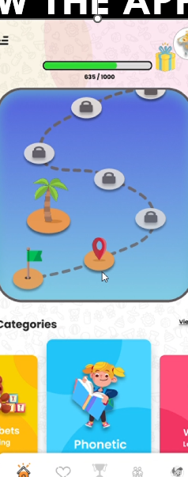
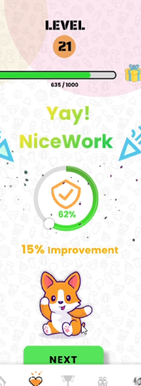
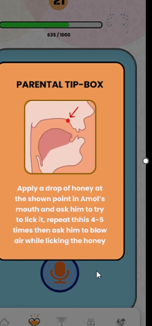

# 🗣️ Vaani App - AI Speech Therapy Companion


**Vaani** is an AI-powered speech therapy and early learning application designed to help children improve their pronunciation, vocabulary, and communication skills. 

Built with **Flutter** and **Generative AI**, it provides a gamified learning path for kids and a detailed analytics dashboard for parents to track progress.

## 🚀 Key Features

### 👶 For Children (Gamified Learning)
* **Interactive Speech Practice:** Real-time feedback on pronunciation using AI voice analysis.
* **Gamified Journey:** A "Candy Crush" style learning path that unlocks new levels as the child improves.
* **Visual Aids:** Fun characters and animations to keep children engaged.
* **Achievement System:** Badges and rewards to motivate daily practice.

### 👨‍👩‍👧‍👦 For Parents (Analytics & Control)
* **Detailed Progress Reports:** Track accuracy percentages for specific phonetics (e.g., Hindi vowels).
* **Activity Logs:** Monitor daily learning time and skill acquisition graphs.
* **Smart Tips:** AI-suggested oral motor exercises (e.g., tongue positioning) based on the child's weak areas.
* **Assessment Tools:** Built-in hearing tests and oral photo analysis.

## 📸 App Screenshots

### **1. Onboarding & Assessment**
| Assessment Menu | Age Selection | Sign Up |
|:---:|:---:|:---:|
|  |  |  |

### **2. Gamified Learning (Child View)**
| Learning Path | Speech Practice | Success Feedback | Achievements |
|:---:|:---:|:---:|:---:|
|  |  |  |  |

### **3. Parent Dashboard & Insights**
| Detailed Analytics | Parental Tips |
|:---:|:---:|
|  |  |

## 🛠️ Tech Stack

* **Frontend:** Flutter (Dart)
* **Backend:** Python / Node.js (TBD)
* **AI Models:** * **Speech Analysis:** OpenAI Whisper / Google Speech-to-Text
    * **GenAI:** Google Gemini (for personalized tips)
* **State Management:** Provider / Bloc

## 📦 Installation

1.  **Clone the repository:**
    ```bash
    git clone [https://github.com/nikhil-srivastava-ml/Vaani-App.git](https://github.com/nikhil-srivastava-ml/Vaani-App.git)
    ```
2.  **Install Dependencies:**
    ```bash
    flutter pub get
    ```
3.  **Run the App:**
    ```bash
    flutter run
    ```

---
**Developed by [Nikhil Srivastava](https://github.com/nikhil-srivastava-ml)**