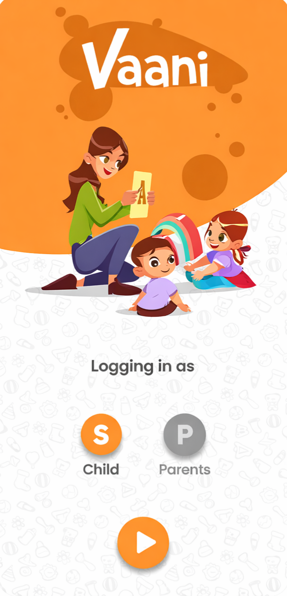

# 🗣️ Vaani App - AI Speech Therapy Companion

<table>
  <tr>
    <td width="50%" align="center">
      <h3>Start Learning</h3>
      
    </td>
    <td width="50%" align="center">
      <h3>See it in Action 🎥</h3>
      
    </td>
  </tr>
</table>

<br>

**Vaani** is an AI-powered speech therapy and early learning application designed to help children improve their pronunciation, vocabulary, and communication skills. 

Built with **Flutter** and **Generative AI**, it provides a gamified learning path for kids and a detailed analytics dashboard for parents to track progress.

## 🚀 Key Features

### 👶 For Children (Gamified Learning)
* **Interactive Speech Practice:** Real-time feedback on pronunciation using AI voice analysis.
* **Gamified Journey:** A "Candy Crush" style learning path that unlocks new levels as the child improves.
* **Visual Aids:** Fun characters and animations to keep children engaged.
* **Achievement System:** Badges and rewards to motivate daily practice.

### 👨‍👩‍👧‍👦 For Parents (Analytics & Control)
* **Detailed Progress Reports:** Track accuracy percentages for specific phonetics (e.g., Hindi vowels).
* **Activity Logs:** Monitor daily learning time and skill acquisition graphs.
* **Smart Tips:** AI-suggested oral motor exercises based on the child's weak areas.
* **Role-Based Access:** Secure login options for both Parents and Children.

## 🛠️ Tech Stack & AI Models

* **Frontend:** Flutter (Dart)
* **Backend:** Python (FastAPI / Flask) / Node.js
* **State Management:** Provider / Bloc

### 🧠 AI & Machine Learning Pipeline
* **ASR (Automatic Speech Recognition):** * **OpenAI Whisper / Wav2Vec 2.0:** High-accuracy models used to transcribe speech and detect pronunciation errors in real-time.
    * **Google Speech-to-Text API:** Fallback engine for multilingual support.
* **NLP (Natural Language Processing):**
    * **BERT / Transformers:** Used for intent classification and context understanding.
* **Generative AI:**
    * **Google Gemini / GPT-4o:** Generates personalized therapy tips and dynamic conversation responses for the child.
* **Audio Processing:**
    * **Librosa / PyDub:** For analyzing pitch, tone, and speech clarity.

## 📦 Installation

1.  **Clone the repository:**
    ```bash
    git clone [https://github.com/nikhil-srivastava-ml/Vaani-App.git](https://github.com/nikhil-srivastava-ml/Vaani-App.git)
    ```

2.  **Install Dependencies:**
    ```bash
    flutter pub get
    ```

3.  **Run the App:**
    ```bash
    flutter run
    ```

## 🤝 Contributing

Contributions are welcome! Please follow these steps:
1.  Fork the Project
2.  Create your Feature Branch (`git checkout -b feature/AmazingFeature`)
3.  Commit your Changes (`git commit -m 'Add some AmazingFeature'`)
4.  Push to the Branch (`git push origin feature/AmazingFeature`)
5.  Open a Pull Request

---
**Developed by [Nikhil Srivastava](https://github.com/nikhil-srivastava-ml)**